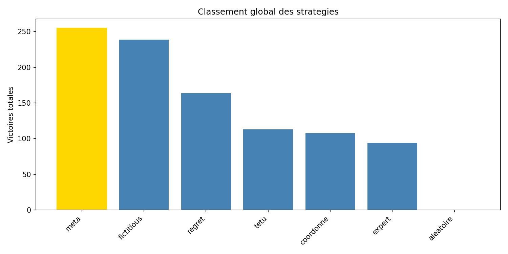
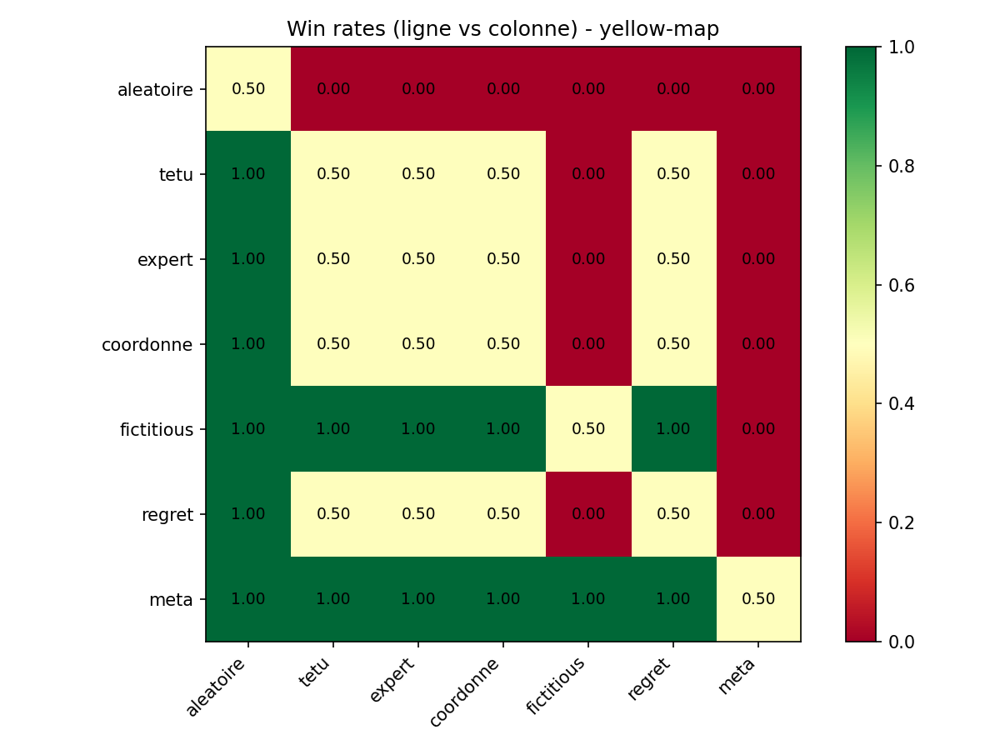
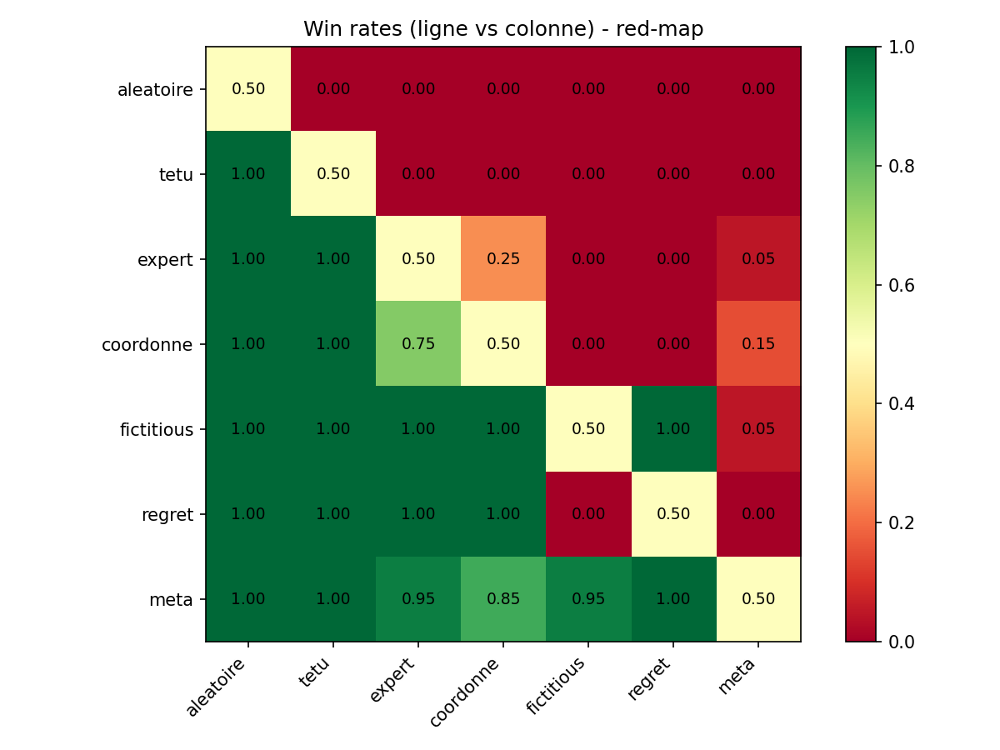
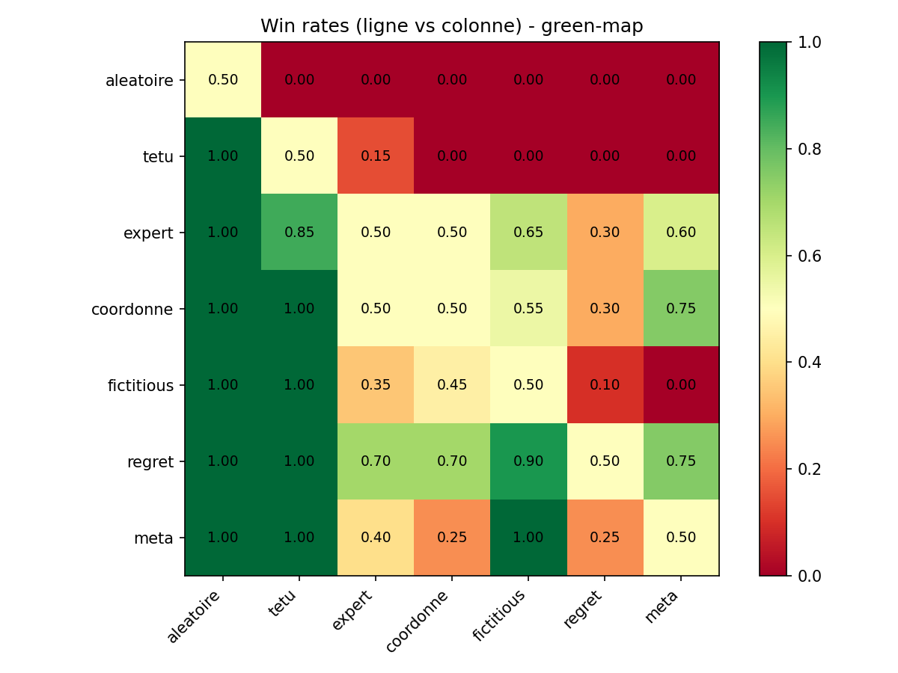
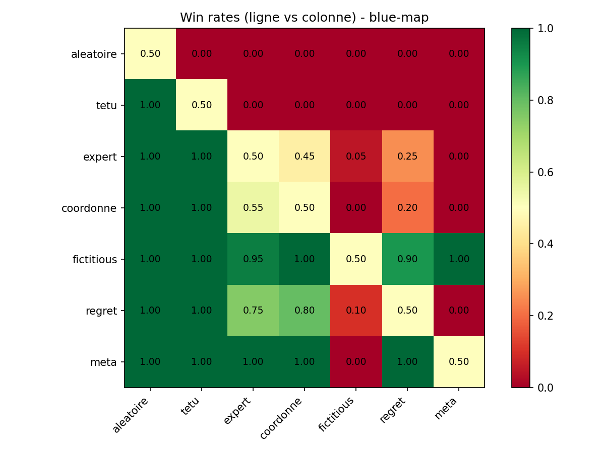
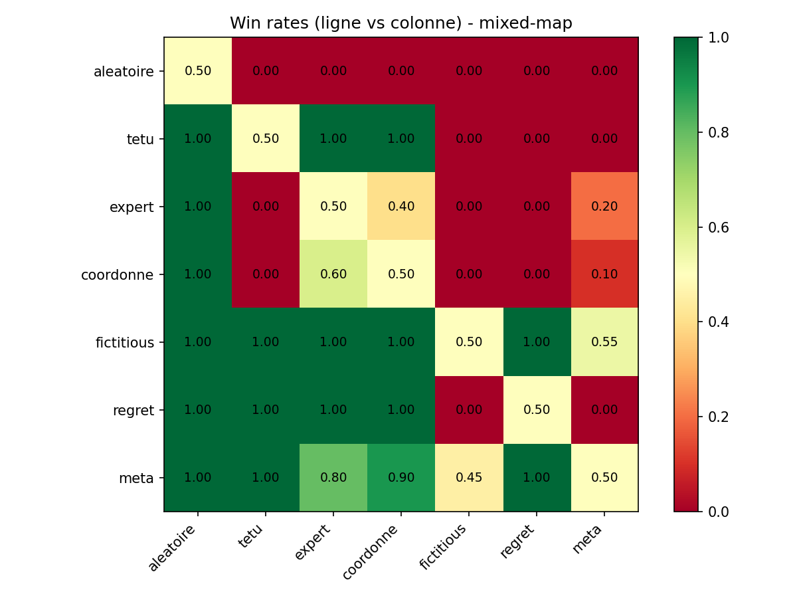

# Competitive Level-Based Foraging — Stratégies et Théorie des Jeux

Simulation d'un jeu stratégique compétitif où deux équipes s'affrontent pour collecter des ressources sur une carte, en appliquant des concepts de **théorie des jeux** (équilibre de Nash, fictitious play, regret matching).

Projet réalisé dans le cadre du cours **IA et Jeux**, L3 Informatique.

## Apercu du jeu

Deux équipes de joueurs doivent répartir leurs agents sur des fioles disposées sur une carte. Chaque fiole a des **règles de capture différentes** selon son type :

| Type | Condition | Mécanisme |
|------|-----------|-----------|
| **Jaune** | 1 joueur minimum | Majorité simple |
| **Rouge** | 2 joueurs minimum (même équipe) | Majorité |
| **Verte** | 3 joueurs minimum (total) | Majorité |
| **Bleue** | Mécanisme "spy" : 1 joueur seul bat un groupe de 2+ | Sinon majorité (seuil 2) |

Les décisions sont **simultanées**, les joueurs ont une **observabilité totale** et une **mémoire parfaite** des tours précédents.

## Stratégies implémentées

7 stratégies allant de baselines naïves à des algorithmes adaptatifs :

| # | Stratégie | Type | Description |
|---|-----------|------|-------------|
| 1 | **Aléatoire Uniforme** | Stationnaire | Tirage uniforme parmi ~15 000 allocations (baseline) |
| 2 | **Têtu** | Stationnaire | Joue toujours la meilleure allocation fixe |
| 3 | **Aléatoire Expert** | Stationnaire | Tirage parmi les 10 meilleures allocations |
| 4 | **Aléatoire Coordonné** | Stationnaire | Tirage pondéré favorisant la concentration |
| 5 | **Fictitious Play** | Adaptatif | Meilleure réponse à la moyenne historique de l'adversaire |
| 6 | **Regret Matching** | Adaptatif | Jeu proportionnel aux regrets positifs accumulés |
| 7 | **Méta Stratégie** | Adaptatif | Classification de l'adversaire (entropie de Shannon) + réponse adaptée |

La **Méta Stratégie** est notre contribution principale : elle classifie le comportement adverse (fixe / aléatoire / adaptatif) via l'entropie de Shannon, puis adapte sa réponse (best response, diversification, ou fictitious play avec decay). Elle intègre aussi des optimisations spécifiques pour les fioles bleues (spy-in, spread).

## Résultats du tournoi

Round-robin complet : 7 stratégies, 5 cartes, 10 runs de 50 épisodes par matchup (1050 matchs au total).

### Classement global

| Rang | Stratégie | Victoires (/300) |
|------|-----------|-------------------|
| 1 | **Méta** | 255 |
| 2 | Fictitious Play | 240 |
| 3 | Regret Matching | 165 |
| 4 | Coordonné | 118 |
| 5 | Expert | 108 |
| 6 | Têtu | 80 |
| 7 | Aléatoire | 0 |

<p align="center">
  
</p>

### Heatmaps par carte

<p align="center">
  
  
</p>
<p align="center">
  
  
</p>
<p align="center">
  
</p>

### Observations clés

- **Equilibre de Nash** observé sur yellow-map : têtu vs regret = 0-0 systématique (les deux convergent vers la même allocation optimale)
- **Matching pennies** sur green-map : aucune stratégie pure ne domine, les stationnaires battent les adaptatives
- **Dilemme du surplus** sur blue-map : fictitious counter le spread de méta (10-0), mais méta reste robuste contre tout le reste
- **Aucune stratégie universelle** : cohérent avec la théorie, toute stratégie a des faiblesses exploitables

## Structure du projet

```
src/
├── strategies.py        # 7 stratégies (classe de base + implémentations)
├── utils.py             # Scoring, génération d'allocations, analyse
├── tournoi.py           # Système de tournoi round-robin (sans graphiques)
├── main.py              # Version interactive avec affichage pygame
├── main_strategies.py   # Version graphique avec stratégies
├── search/              # Pathfinding A* pour les déplacements
└── pySpriteWorld/       # Moteur graphique (sprites, cartes, collisions)

docs/
├── rapport.md           # Rapport détaillé avec analyse théorique
└── figures/             # Heatmaps et graphiques du tournoi
```

## Installation et exécution

```bash
# Cloner le repo
git clone https://github.com/<username>/competitive-level-based-foraging.git
cd competitive-level-based-foraging

# Installer les dépendances
pip install pygame numpy matplotlib

# Lancer une partie interactive
python src/main.py

# Lancer le tournoi complet (~40 min)
python src/tournoi.py
```


